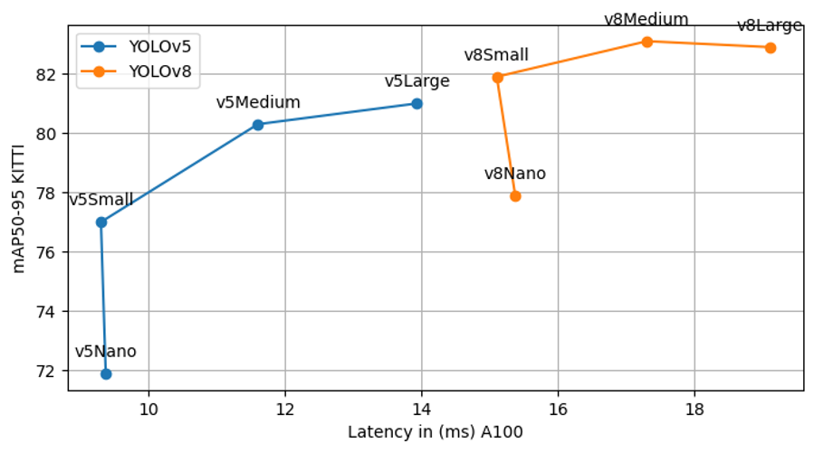

# YOLOv8 Vs YOLOv5

### This project was created as part of Dissertation for MSc in Big Data Analytics and Artificial Intelligence at ATU.
The objective is to compare the object detection performance of YOLOv5 and YOLOv8 on KITTI dataset. The result is displayed in the below graph.

### The robot car built using Raspberry Pi 4B, Arduino UNO and Pi Camera 3 is displayed below.
#

